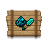

# Afterlife's Delight



**A Farmer's Delight add-on for Hardcore worlds where death is only the start of dinner.**

Afterlife's Delight was made for playing Hardcore with friends. In vanilla, one unlucky creeper can leave a friend watching everyone else play. Here, a fallen player returns as a ghost while the group gets a chance to cook them back to life.

After leaving the death screen, the soul appears safely near its body. Mobs ignore ghosts, and ghosts cannot fight, break blocks, or collect ordinary items. Resurrection requires special afterlife food: a stew or apple pie prepared by a living cook, or seasoned in advance so it follows its owner through death.

If every player becomes a ghost and nobody has the right food, no one is left to use the Cooking Pot. The world stays quiet until a new cook joins the server.

## Features

- Four resurrection effects, each available as a stew and an apple pie.
- Mix-and-match seasonings determine whether a dish follows the soul through death and whether it returns the ghost to the place they died.
- Whole pies can be placed and divided into four servings.
- Ghosts can drop any item, but can only pick up resurrection food. They can pass it to a living player, place pies, and eat pie servings themselves.
- A new pestle tool grinds ingredients on the Farmer's Delight Cutting Board.
- A cold filter, fog, particles, ambience, translucent body, echo trail, and camera sway shape the spirit world.
- Ghost state persists through relogs and full game restarts.
- Flight, sounds, atmosphere, and interaction with physical corpses are configurable.
- All items are collected in a dedicated creative tab.

## Resurrection food

| Effect | Stew | Apple pie | Result |
| --- | --- | --- | --- |
| Memorial | Memorial Stew | Memorial Apple Pie | Resurrects the ghost at their current position. |
| Deathless Devotion | Stew of Deathless Devotion | Apple Pie of Deathless Devotion | Follows the soul through death and resurrects the ghost wherever they are. |
| Rejoining | Rejoining Stew | Rejoining Apple Pie | Returns the soul to a safe point near the place of death and resurrects them. |
| Unbroken Reunion | Stew of Unbroken Reunion | Apple Pie of Unbroken Reunion | Follows the soul through death, returns it to the place of death, and resurrects the ghost. |

Every resurrection dish restores health and hunger completely. Living players can eat stew and pie servings as ordinary food; their supernatural effects only apply to ghosts.

Apple pies use an Echo Pie Crust made from Echo Dust, wheat, and milk. The added seasonings determine the finished pie's resurrection properties.

## Grinding

Pestles turn rare materials into seasonings on the Cutting Board:

- Echo Shard -> 4 Echo Dust
- Chorus Fruit -> 4 Ender Seasoning
- Netherite Scrap -> 4 Netherite Powder

Every pestle can grind Echo Shards. Iron-tier pestles and above can process Chorus Fruit, while only the Netherite Pestle can grind Netherite Scrap. Pestles support Unbreaking and Mending.

## Compatibility

Afterlife's Delight works without `keepInventory` and has been tested with:

- Corpse
- GraveStone Mod
- Sophisticated Backpacks stored inside corpses and graves
- Sable: Ragdoll Corpse and Sable's physical ragdolls
- Sodium and Iris without a shader pack

Ghosts cannot recover ordinary inventory items until they are resurrected. Resurrection food prepared to follow the soul is transferred without duplication.

When physical ragdolls are installed, a corpse may slip from a ghost's hands. The chance and pickup cooldown are configurable.

## Requirements

- Minecraft 1.21.1
- NeoForge 21.1.248 or newer
- Farmer's Delight 1.3.2 or newer
- Java 21

## Installation

1. Install NeoForge for Minecraft 1.21.1.
2. Install Farmer's Delight.
3. Place the Afterlife's Delight `.jar` in the `mods` folder on both the client and server.

## Configuration

Settings are available from the mod list in the game's Mods menu.

The common configuration controls ghost flight, death and resurrection sounds, and the chance and cooldown for dropping physical corpses. Custom sounds use the format `sound_id volume pitch`, for example `minecraft:entity.warden.sonic_boom 1.0 1.0`.

The client configuration controls the spirit-world filter, particles, fog, ambient volume, and camera sway.

## Development

Build the mod:

```powershell
.\gradlew.bat build
```

Launch a development client or server:

```powershell
.\gradlew.bat runClient
.\gradlew.bat runServer
```

Compatibility test profiles are available for `corpse`, `gravestone`, `backpacks`, `corpse_backpacks`, and `gravestone_backpacks`. Manual testing scenarios are documented in [`docs`](docs/).

## License

The source code and original assets are publicly visible for reference, but this project is **not open source**. All rights are reserved. See [`LICENSE`](LICENSE) for details.

Files inherited from the NeoForge template remain under their original terms; see [`TEMPLATE_LICENSE.txt`](TEMPLATE_LICENSE.txt).
